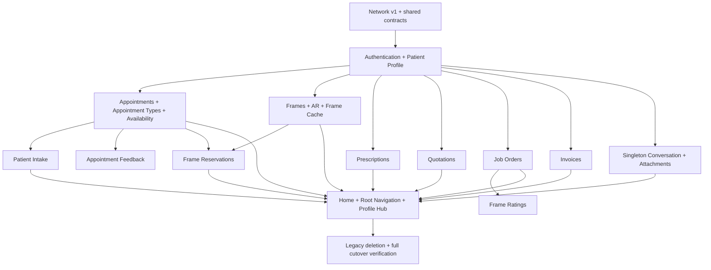

# Backend Alignment V8 — Phase 2 Implementation Plan

Status: Approved — Phase 2 complete (2026-07-27)

Source specification:
`docs/specs/backend-alignment-v8-spec.md`

Backend contract:
`docs/API_CONTRACT.md` at backend commit `ebd1e2e` (2026-07-27)

## Recommended Delivery Strategy

Implement the complete 34-route patient contract as one release cutover, built
internally as dependency-ordered vertical slices.

This is the most cost-efficient strategy because the backend has already
retired the old mobile contract and the project does not require backward
compatibility:

- use one `/api/v1/` Retrofit base URL;
- do not create a second Retrofit stack, legacy adapter layer, feature flag, or
  runtime fallback;
- replace each legacy feature with its new patient equivalent;
- delete retired routes, models, repositories, screens, DI bindings, and tests
  when their replacement compiles and passes;
- keep every intermediate commit buildable, but release only after the full
  route allowlist and navigation cutover are verified.

The implementation should optimize for a simple final architecture rather than
for temporarily running old and new APIs side by side.

## Target Application Shape

### Root navigation

The approved root destinations are:

1. **Home** — next appointment, intake prompt, and a small featured-frame
   preview without loading every patient record.
2. **Frames** — searchable/paged frame catalog, detail, AR, and reservation
   entry.
3. **Appointments** — list, detail, booking, rescheduling, cancellation,
   intake, and feedback.
4. **Profile** — account/patient profile plus entry points for messages,
   reservations, prescriptions, quotations, job orders, and invoices.

Chat remains a non-root destination accessible from the existing floating
action and Profile. This preserves the useful current interaction pattern
without consuming a fifth root destination.

### Domain boundaries

```text
Identity
  Auth + PatientProfile

Scheduling
  AppointmentType + Availability + Appointment + PatientIntake + Feedback

Frames
  Frame + FrameVariant + FrameReservation + AR

Patient Records
  Prescription + Quotation + JobOrder + FrameRating + Invoice

Communication
  Conversation + Message + MessageAttachment + MessageContext
```

Each boundary owns its Retrofit service, DTOs, repository interface,
repository implementation, Hilt binding, ViewModels, and presentation package.
Cross-boundary references use IDs or small domain summaries rather than DTOs.

## Shared Technical Decisions

### API base and allowlist

- Change debug and release API base URLs to end in `/api/v1/`.
- Keep Retrofit annotations relative to that versioned base.
- Add a contract test that enumerates service annotations and compares them to
  the approved 34 method/path pairs.
- Delete every retired annotation rather than leaving unreachable legacy
  declarations.

### Transport and domain models

- Keep resource-specific response wrappers because some lists are paginated
  while reservations and messages are not.
- Reuse shared `PaginationLinks`, `PaginationMeta`, and structured
  `ValidationErrorBody` DTOs where the JSON shapes are identical.
- Use a Kotlinx custom money serializer that accepts either JSON numbers or
  numeric strings. Convert to `BigDecimal` at the repository boundary so
  frame/reservation string prices and quotation/invoice numeric prices share
  one safe domain representation.
- Model unknown enum/status values explicitly and fail closed for actions.
- Keep timestamps as contract ISO-8601 strings in DTOs, then parse through
  shared `java.time` helpers into clinic-aware presentation values.
- Treat `patient_number` as a string; do not assume every identifier is
  numeric merely because most resource IDs currently are.

### Errors and rate limits

- Centralize parsing for 401, 403, 404, 422, and 429.
- Preserve field-level 422 errors for forms.
- Treat appointment conflicts as 422, not 409.
- Continue routing 401 through the existing logout event bus.
- Do not retry mutations automatically.
- Honor the authenticated 60-requests-per-minute limit. Replace aggressive chat
  polling with lifecycle-aware refresh while visible plus user-initiated
  refresh; do not add WebSockets or a new realtime dependency in this
  migration.

### Security and local data

- Store only the Sanctum token in encrypted preferences.
- Keep intake, prescriptions, quotations, job orders, invoices, ratings,
  profile demographics, and messages network-only.
- Room may cache the public/non-clinical frame catalog only.
- Reduce debug HTTP logging from BODY to BASIC so tokens, intake narratives,
  prescriptions, and patient details are not written to Logcat.
- Fetch attachments only through the authenticated attachment endpoint.
- Validate attachment size and MIME type locally for UX, while treating backend
  validation as authoritative.
- Open DOC/DOCX/PDF files through a temporary content URI with scoped read
  permission; do not render active document content inside a WebView.
- Never treat Android action visibility as authorization. Rating,
  cancellation, intake, and ownership rules remain server-enforced.

### State and navigation

- Preserve `sealed interface` UI states exposed through `StateFlow`.
- Use type-safe `@Serializable` routes for every new destination.
- Terminal mutations consume the returned resource directly when the contract
  returns it, avoiding unnecessary refetches.
- Refresh a parent list when navigating back only when its visible data can
  have changed.

## Component Dependencies



Authentication/profile follows the network foundation because every protected
feature depends on a working patient session. After that, the scheduling,
frames, records, and communication tracks are largely independent until final
navigation and Home/Profile integration.

## Implementation Order

### Stage 0 — Baseline and contract fixtures

Establish a trustworthy starting point before changing runtime behavior.

- Capture canonical JSON fixtures from `API_CONTRACT.md` for every resource
  group, including paginated, unpaginated, validation, authorization, and
  mutation responses.
- Record current unit, lint, and build results.
- Add or identify a route-allowlist test location.
- Inventory legacy files and their target replacements so deletions are
  deliberate.

Checkpoint:

- Existing unit tests and debug assembly have a recorded baseline.
- Every planned DTO has a contract fixture or an explicit reference to a fully
  expanded resource.

### Stage 1 — Network and identity foundation

Cut the application over to the versioned API foundation.

- Change the Retrofit base URL to `/api/v1/`.
- Introduce shared pagination, error, money, and timestamp transport helpers.
- Reduce debug network logging to BASIC.
- Migrate auth/profile from `/user` to `/me`.
- Expand the domain identity from the old customer-shaped `User` to an
  account-linked `PatientProfile`.
- Update registration, login, profile display, and profile editing fields.

Checkpoint:

- Register, login, logout, GET `/me`, and PATCH `/me` pass contract/repository
  tests.
- No sensitive response body is logged.
- The authenticated shell and Profile screen work against v1.

### Stage 2 — Scheduling vertical slice

Replace the old visit-reason booking contract end to end.

- Replace `VisitReason` with `AppointmentType`.
- Migrate availability to `/appointment-availability` using
  `appointment_type_id`.
- Add conditional `referring_source` for referral appointment types.
- Add pagination to appointment history.
- Align appointment list/detail fields, including the name-only assigned
  optometrist.
- Preserve booking, reschedule, and cancel UX while removing unsupported
  contact-note editing.
- Reuse returned appointment resources after mutations.

Checkpoint:

- All seven appointment setup/resource routes decode and behave correctly.
- Booking submits a backend-provided slot without inventing a provider or visit
  reason ID.
- Pending/confirmed mutation rules and 422 states are covered.

### Stage 3 — Intake and appointment feedback

Build the two appointment-dependent workflows.

- Add intake GET, draft PUT, and explicit submit POST.
- Keep all intake values in memory only.
- Disable editing for submitted and verified states.
- Require confirmation before submission.
- Replace appointment/order feedback with completed-appointment-only feedback.
- Remove feedback history because no GET route exists.

Checkpoint:

- Draft creation/update handles 200 and 201.
- Submitted/verified intake cannot be edited locally and backend 422 remains
  authoritative.
- Feedback is reachable only for completed owned appointments.

### Stage 4 — Frames, AR, and frame cache

Replace the mixed product/accessory catalog with a frame-only boundary.

- Replace product/catalog services and repositories with `/frames`.
- Introduce `Frame` and `FrameVariant` domain models.
- Retain search, paging, sorting, images, and AR eligibility from the new
  resource.
- Remove the current brand/category picker UI because v1 exposes filter query
  parameters but no patient endpoint that supplies filter IDs. Do not retain
  retired `/brands` or `/categories` calls or guess IDs from display names.
- Adapt the existing AR renderer/ViewModel to frame models rather than keeping
  a legacy product compatibility type.
- Rename the Room cache to frame semantics and increment its schema. A
  destructive cache migration is acceptable because it contains no user or
  clinical data.
- Remove accessory tabs, accessory shelves, order actions, and product-type
  policies that no longer represent the API.

Checkpoint:

- Both frame endpoints and pagination fixtures pass.
- AR launches only with a valid backend AR asset.
- Offline cache can expose frames only and contains no patient data.

### Stage 5 — Frame reservations

Build reservation behavior on top of frames and appointments.

- Add the unpaginated reservation list.
- Create reservations with 1–5 selected frame variants.
- Offer optional linking to an owned appointment without requiring it.
- Use the same sanitized reservation DTO for list/create/cancel responses.
- Allow cancellation UI only for `requested` and `prepared`; backend remains
  authoritative.
- Navigate from frame detail to a reservation review/confirmation flow rather
  than an order screen.

Checkpoint:

- All three reservation routes pass contract and repository tests.
- Android models none of the explicitly excluded commercial/internal fields.
- Successful create/cancel updates UI from the returned resource.

### Stage 6 — Read-only patient records

Replace legacy commerce history with the actual clinic workflow.

- Make prescription history paginated while preserving its existing clinical
  display.
- Add quotation list/detail with nullable latest revision and immutable item
  pricing.
- Add job-order list/detail and the queued-to-dispensed status timeline.
- Add invoice list/detail with items, posted payments, and monetary summary.
- Do not expose creation, acceptance, payment, cancellation, or editing actions
  that lack patient routes.
- Remove order history, order request, order cancellation, billing detail, and
  billing PDF features.

Checkpoint:

- All eight read-only record routes page and decode according to contract.
- Raw detail-only fields do not leak into unrelated presentation models.
- No UI suggests a patient can mutate clinic-controlled records.

### Stage 7 — Frame ratings

Add rating only after job-order detail is stable.

- Expose the action only for a dispensed job order item with a non-null matching
  `product_variant_id`.
- Submit rating/comment and optional dispensing event exactly as documented.
- Support revisions by replacing visible current rating/comment with the
  returned parent resource while retaining revision history for detail.
- Handle backend 403/404/422 without treating local eligibility as proof.

Checkpoint:

- Create and revision fixtures pass.
- Mismatched or ineligible requests surface backend errors safely.
- Moderation/internal identifiers are not needed for action authorization.

### Stage 8 — Singleton conversation and attachments

Migrate messaging without retaining conversation-ID route plumbing.

- Replace plural ID-based endpoints with singleton `/conversation` paths.
- Remove explicit mark-read requests and do not optimistically clear the
  backend unread count.
- Preserve message contexts. Appointment contexts remain actionable; frame
  product contexts may open frame detail; historical order contexts render as
  non-interactive.
- Encode multipart contexts using sequential
  `contexts[N][type]`/`contexts[N][id]` fields.
- Expand attachment validation to the documented image, PDF, DOC, and DOCX
  formats up to 10 MB.
- Download attachments through the authenticated service.
- Replace rapid polling with lifecycle-aware, rate-limit-safe refresh.

Checkpoint:

- All four conversation routes pass fixtures and mapping tests.
- Cross-patient attachments remain inaccessible through backend enforcement.
- Temporary attachment files are cleaned up.
- Chat does not approach the 60-request/minute limit.

### Stage 9 — Home, navigation, and profile integration

Integrate completed vertical slices into the approved information architecture.

- Change the Catalog root to Frames.
- Wire Appointments to intake and feedback.
- Make Profile the hub for Messages, Reservations, Prescriptions, Quotations,
  Job Orders, and Invoices.
- Keep Home intentionally lean: next appointment/intake prompt and a small
  featured-frame preview. Avoid loading every record collection on every Home
  visit.
- Preserve bottom-tab back-stack state and wizard terminal navigation rules.
- Update message-context navigation to supported destinations only.

Checkpoint:

- All destinations are reachable without legacy routes.
- Root tab switching preserves state and does not grow the back stack.
- Home avoids unnecessary network fan-out.

### Stage 10 — Legacy deletion and release verification

Finish the cutover by deleting code that no longer represents a backend
capability.

- Remove legacy Product/Order/Billing/VisitReason/FeedbackHistory service,
  DTO, domain, repository, DI, navigation, screen, and test artifacts after
  their replacements are verified.
- Remove stale copy referring to accessories, purchases, orders, billing PDFs,
  visit reasons, or editable contact notes.
- Update `CONTEXT.md` to the patient workflow and 34-route contract.
- Run route allowlist, focused tests, full unit tests, formatting, lint, and
  debug assembly.
- Manually smoke-test the complete patient journey on an emulator against
  backend commit `ebd1e2e` or a later contract-equivalent commit.

Checkpoint:

- No retired Retrofit annotation or reachable UI action remains.
- All 34 approved method/path pairs are represented.
- The final repository contains one patient API architecture, not parallel
  legacy/new stacks.

## Legacy Replacement Map

| Retired Android concept | Replacement |
|---|---|
| `/user` profile | `/me` + `PatientProfile` |
| `VisitReason` and `/visit-reasons` | `AppointmentType` and `/appointment-types` |
| `/appointments/availability` | `/appointment-availability` |
| Appointment contact-note mutation | Removed; create-time note remains |
| Mixed `Product` catalog and accessories | Frame-only catalog |
| Accessory order request | Frame reservation |
| Order list/detail/status | Job order list/detail/status |
| Billing detail/PDF | Invoice list/detail; no PDF |
| Feedback history/order feedback | Completed-appointment feedback submission |
| ID-based plural conversations | Singleton conversation |
| Explicit mark-read | Removed; unread count is server-owned read-only context |

## Parallel and Sequential Work

After Stage 1, the following tracks are logically parallel:

- Scheduling: Stages 2–3
- Frames: Stages 4–5
- Patient records: Stages 6–7
- Communication: Stage 8

Within each track, stages are sequential because later UI depends on earlier
domain/repository behavior. Stage 9 must wait for all tracks so navigation and
Home/Profile wiring are done once. Stage 10 is always last.

Even if work is executed serially by one engineer, these boundaries keep
context small and prevent unrelated files from changing together.

## Risks and Mitigations

| Risk | Mitigation |
|---|---|
| Changing the base URL breaks every old service immediately. | Perform the work on one cutover branch, migrate identity first, remove legacy entry points as replacements land, and do not release intermediate builds. |
| Money fields alternate between JSON numbers and strings. | Use one flexible transport serializer and `BigDecimal` domain values with fixture coverage. |
| Room contains stale accessory/product rows. | Rename to frame cache, increment schema, and destructively recreate cache-only tables. |
| Health data reaches Room or logs. | Keep clinical repositories network-only and reduce HTTP logging to BASIC before endpoint migration. |
| Unpaginated messages/reservations grow large. | Keep repositories explicit about unpaginated responses, avoid duplicate copies, and render lazily in Compose; record a future backend pagination threshold if growth becomes material. |
| Chat polling exhausts the 60/minute rate limit. | Refresh only while visible at a conservative interval and on explicit user action; no background polling. |
| Home triggers excessive API fan-out. | Limit Home to appointments/intake and a small frame preview; use Profile as the records hub. |
| Unknown future statuses enable invalid actions. | Map unknown statuses to non-actionable domain values. |
| Deep links reach removed order/billing screens. | Remove legacy routes and fail closed when deserializing unsupported destinations. |
| Raw detail responses contain internal IDs. | DTOs decode only required fields with `ignoreUnknownKeys`; domain models expose patient-relevant fields only. |
| Multipart contexts are encoded incorrectly. | Build indexed parts from contract fixtures and verify with MockWebServer request inspection. |

## Verification Checkpoints

At each stage:

```powershell
.\gradlew ktlintCheck
.\gradlew testDebugUnitTest --tests "<focused test pattern>"
.\gradlew assembleDebug
```

At the final cutover:

```powershell
.\gradlew ktlintFormat
.\gradlew ktlintCheck
.\gradlew testDebugUnitTest
.\gradlew lintDebug
.\gradlew assembleDebug
```

Manual final checks:

- registration, login, logout, and profile editing;
- appointment booking, rescheduling, cancellation, and intake submission;
- frame browsing, AR, reservation creation, and cancellation;
- prescription, quotation, job-order, rating, and invoice detail;
- message send, context navigation, and authenticated attachment opening;
- appointment feedback;
- offline frame cache behavior;
- back-stack behavior across all four roots;
- 401 logout, 422 validation, 429 rate-limit, and network-loss states.

## Phase Gate

Phase 2 was approved on 2026-07-27. The Phase 3 task list may be produced with
focused tasks of approximately five files or fewer, each with explicit
acceptance and verification criteria. No production code should be changed
until that task list is approved.
