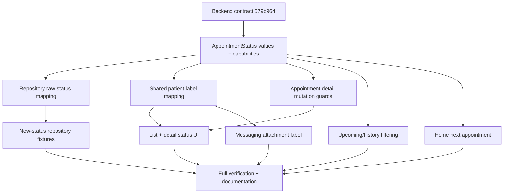

# Backend Alignment V9 — Phase 2 Implementation Plan

Status: Approved — Phase 2 complete (2026-07-27)

Approved specification:
`docs/specs/backend-alignment-v9-spec.md`

Backend contract:
`docs/API_CONTRACT.md` at backend commit `579b964`

## Overview

Replace Android's retired appointment lifecycle with the backend's
`scheduled → checked_in → fulfilled` lifecycle while preserving the completed
V8 architecture, routes, payloads, navigation, and non-appointment features.

Delivery is a direct cutover. The app is not deployed, so no legacy status
aliases, adapter, migration, or dual behavior will be retained.

## Architecture Decisions

### Domain owns lifecycle capabilities

`AppointmentStatus` will contain exactly:

- `SCHEDULED`
- `CHECKED_IN`
- `FULFILLED`
- `CANCELLED`
- `NO_SHOW`
- `UNKNOWN`

The domain status will expose the business capabilities needed by consumers:

- active/upcoming eligibility;
- cancellation eligibility;
- rescheduling eligibility;
- feedback eligibility.

This prevents Home, appointment list, appointment detail, and future consumers
from maintaining separate status sets that can drift.

`UNKNOWN` is always non-active and non-actionable. It is still renderable so a
new backend value does not crash the app or silently acquire patient mutation
permissions.

### Repository remains the transport boundary

`AppointmentV1Dtos.AppointmentDto.status` remains a string because the response
shape did not change. `AppointmentV1RepositoryImpl` continues to translate the
raw value to the domain enum.

The mapper will accept only the new documented strings. Previous values are not
aliases. An unexpected string maps to `UNKNOWN`.

No Retrofit service, request DTO, response DTO field, repository interface, DI
binding, pagination model, or API route changes are required.

### Presentation owns patient-facing labels

A small shared presentation mapping will provide:

| Domain status | Patient label |
|---|---|
| `SCHEDULED` | Scheduled |
| `CHECKED_IN` | Checked in |
| `FULFILLED` | Completed |
| `CANCELLED` | Cancelled |
| `NO_SHOW` | No show |
| `UNKNOWN` | Unknown |

Appointment list, detail, and messaging attachment selection will use this
mapping. The backend word `fulfilled` remains visible only in transport/domain
code and technical tests.

Existing status colors may be reassigned to the new semantic equivalents:

- Scheduled uses the current confirmed/success treatment.
- Checked in uses the current informational treatment.
- Completed uses the existing neutral completed treatment.
- Cancelled and no-show retain the existing destructive treatment.
- Unknown uses a neutral/on-surface-variant treatment.

### Mutation rules are enforced twice

The Compose UI hides actions that are not valid:

- Scheduled: Reschedule and Cancel
- Checked in: Cancel only
- All other statuses: neither action

`AppointmentDetailViewModel` independently checks the loaded appointment status
before opening the reschedule sheet or sending cancel/reschedule requests. This
defense-in-depth prevents stale callbacks, tests, or future UI changes from
issuing a locally invalid request.

The backend remains authoritative and may still return 422 for races or other
validation failures.

### Active and history grouping is explicit

Only `SCHEDULED` and `CHECKED_IN` are active statuses:

- Home may select them as the next appointment.
- Upcoming may show them when their time is not in the past.

`FULFILLED`, `CANCELLED`, `NO_SHOW`, and `UNKNOWN` are not active and appear in
History. An active appointment whose scheduled time is already past continues
to fall into History under the existing time rule.

## Component Dependencies



The domain cutover is the only shared prerequisite. Repository, appointment UI,
Home, and messaging behavior must not be changed before the new enum compiles.

## Implementation Order

### Stage 0 — Baseline and contract evidence

Goal: establish a failing test baseline for the new backend vocabulary without
changing production behavior.

Work:

- Record backend commit `579b964` in focused test fixtures or test names where
  useful.
- Replace old raw appointment-status examples in domain/DTO/repository tests
  with expectations for `scheduled`, `checked_in`, and `fulfilled`.
- Add explicit unknown-value and capability expectations.
- Run focused tests and confirm they fail against the old enum/mapping.

Verification checkpoint:

- Failures are caused by missing V9 status behavior, not unrelated compilation
  or environment problems.
- The existing debug build remains the known baseline.

### Stage 1 — Domain lifecycle and repository mapping

Goal: establish the new lifecycle as the single Android source of truth.

Work:

- Replace the old `AppointmentStatus` constants.
- Add fail-closed capability properties.
- Map only the five documented raw strings; map all others to `UNKNOWN`.
- Update repository fixtures for list, detail, create, cancel, and reschedule
  results.
- Keep DTOs, service declarations, request bodies, and route count unchanged.

Verification checkpoint:

- Domain mapping and capability tests pass.
- Repository appointment tests pass.
- A source search finds no old enum constant in production.
- `.\gradlew assembleDebug` succeeds.

### Stage 2 — Appointment list and booking behavior

Goal: make appointment creation, list grouping, and status presentation coherent
with the new lifecycle.

Work:

- Update booking expectations so successful creation returns `SCHEDULED`.
- Replace terminal/active sets in Upcoming and History with domain
  capabilities.
- Add shared patient-facing status labels and apply them to appointment-list
  pills/chips.
- Map status colors to the approved new states.
- Add filtering tests for scheduled, checked-in, fulfilled, cancelled,
  no-show, unknown, and past active appointments.

Verification checkpoint:

- Booking ViewModel tests pass.
- Appointment formatting/filtering tests pass.
- List UI compiles exhaustively for every enum value.
- `.\gradlew assembleDebug` succeeds.

### Stage 3 — Appointment detail actions and feedback

Goal: enforce the asymmetric checked-in cancellation and scheduled-only
rescheduling rules.

Work:

- Replace the shared `canManage` condition with separate `canCancel` and
  `canReschedule` capabilities.
- Show both actions for scheduled and only Cancel for checked-in.
- Expose Leave Feedback only for fulfilled.
- Update detail guidance and badges to the new labels.
- Add ViewModel guards to cancel, show-reschedule, and submit-reschedule paths.
- Preserve current 422 handling and server-returned appointment replacement.

Verification checkpoint:

- ViewModel tests prove no repository mutation is called for invalid statuses.
- Detail presentation tests or pure mapping tests cover all status/action
  combinations.
- Manual preview/runtime check confirms the checked-in action layout.
- `.\gradlew assembleDebug` succeeds.

### Stage 4 — Home and messaging consumers

Goal: remove the final downstream assumptions about the retired vocabulary.

Work:

- Select the next Home appointment from scheduled/checked-in only.
- Update Home test fixtures and selection cases.
- Use the shared patient label in the messaging attachment picker instead of
  lowercasing enum names.
- Confirm appointment context-card navigation remains unchanged.

Verification checkpoint:

- Home tests pass for scheduled, checked-in, terminal, and unknown cases.
- Messaging attachment text never displays `checked_in` or `fulfilled`.
- Appointment/message navigation still compiles.
- `.\gradlew assembleDebug` succeeds.

### Stage 5 — Documentation and release verification

Goal: prove the cutover is complete and synchronize living project context.

Work:

- Update `CONTEXT.md` with the new lifecycle and mutation rules.
- Keep V8 specification/plan/tasks as historical records for commit `ebd1e2e`;
  do not rewrite their completed evidence.
- Search production and current tests for retired appointment constants and raw
  strings.
- Run formatting, focused tests, full tests, lint, and debug assembly.
- Manually smoke-test scheduled, checked-in, fulfilled, cancelled, and no-show
  appointment screens against backend commit `579b964` or a documented
  contract-equivalent revision.

Verification checkpoint:

```powershell
rg -n "AppointmentStatus\.(PENDING|CONFIRMED|ARRIVED|COMPLETED)" app/src
.\gradlew testDebugUnitTest --tests "*Appointment*"
.\gradlew testDebugUnitTest --tests "*HomeViewModelTest"
.\gradlew ktlintCheck
.\gradlew testDebugUnitTest
.\gradlew lintDebug
.\gradlew assembleDebug
```

The source search must return no current production/test references. Historical
V8 documentation may retain the retired terms because it records the previous
contract.

## Expected File Groups

### Domain and repository

- `app/src/main/java/com/eyecare/app/domain/model/AppointmentV1.kt`
- `app/src/main/java/com/eyecare/app/data/repository/AppointmentV1RepositoryImpl.kt`
- Appointment DTO/repository tests

### Appointment presentation

- `AppointmentListScreen.kt`
- `AppointmentDetailScreen.kt`
- `AppointmentDetailViewModel.kt`
- Booking, filtering, and detail tests
- One shared presentation status-label file if needed

### Downstream consumers

- `HomeViewModel.kt` and its tests
- `AttachmentSheet.kt` and focused presentation tests if a suitable test seam
  exists

### Documentation

- `CONTEXT.md`
- `docs/specs/backend-alignment-v9-spec.md`
- `docs/specs/backend-alignment-v9-plan.md`
- Phase 3 task list

Phase 3 will divide these groups into tasks of approximately five files or
fewer. No implementation slice may leave the project uncompilable.

## Parallel and Sequential Work

Must be sequential:

1. Domain enum/capabilities
2. Repository mapping
3. Any production consumer of the enum

After the domain/repository checkpoint, the following are logically independent
but share a small presentation label contract:

- appointment list/booking;
- appointment detail/ViewModel;
- Home selection;
- messaging attachment labels.

If implemented by one agent, keep them sequential to minimize worktree churn.
If parallelized in the future, define the shared label file first and serialize
changes to `AppointmentV1.kt`.

Documentation and final source searches occur only after all consumers compile.

## Risks and Mitigations

| Risk | Impact | Mitigation |
|---|---|---|
| Unknown status maps to an actionable state. | High | Explicit `UNKNOWN`, capability tests, and no default-to-scheduled mapping. |
| Checked-in UI still exposes Reschedule. | High | Separate cancel/reschedule capabilities and ViewModel guards. |
| Old fixture silently maps to `UNKNOWN` and tests still pass. | Medium | Assert exact expected status in every repository response fixture and search current tests for retired strings. |
| List, detail, and messaging labels diverge. | Medium | One shared patient-label mapping with exhaustive enum tests. |
| Home hides a checked-in active appointment. | Medium | Explicit Home test for checked-in selection. |
| Fulfilled is displayed as technical copy. | Low | Presentation maps it to “Completed”; source/test check for user-visible `fulfilled`. |
| Historical V8 docs make source searches noisy. | Low | Restrict cutover searches to `app/src` and update only living `CONTEXT.md`. |
| Backend changes during implementation. | Medium | Pin verification to `579b964` or record the exact contract-equivalent replacement commit. |

## Verification Strategy

### Test-first sequence

For each implementation slice:

1. Add or update a focused test that fails for the missing V9 behavior.
2. Make the smallest production change that passes it.
3. Run the focused test.
4. Run `.\gradlew assembleDebug`.
5. Record the slice result in the Phase 3 task list.

### Required coverage

- Exact raw-string mapping for every documented status.
- Unknown fail-closed behavior.
- Every domain capability across all enum values.
- Booking/create result.
- Repository list/detail/cancel/reschedule results.
- Upcoming/history grouping.
- Scheduled versus checked-in detail actions.
- Fulfilled feedback eligibility.
- Home active appointment selection.
- Shared patient-facing labels.

### Manual checks

- Scheduled detail shows Reschedule and Cancel.
- Checked-in detail shows Cancel only.
- Fulfilled detail shows Leave Feedback.
- Terminal/unknown detail shows no mutation.
- List, detail, Home, and attachment picker use readable consistent labels.

## Open Questions

None. Phase 1 approval fixed the lifecycle, fail-closed behavior, and
patient-facing labels.

## Phase Gate

Phase 2 was approved on 2026-07-27. The Phase 3 task list may be produced with
focused tasks of approximately five files or fewer, explicit acceptance
criteria, and verification commands. No Android production code may be changed
until that task list is approved.
